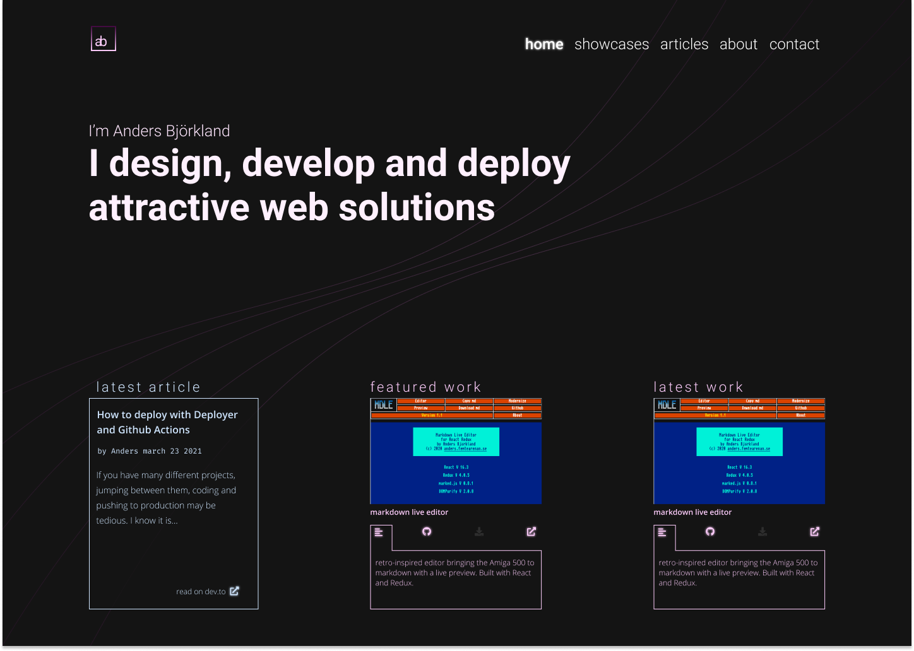

# react-online
react-online is the current source for Anders Björkland's portfolio website: [andersbjorkland.online](https://andersbjorkland.online).

## Features
* Clean and responsive design
* Displays projects via a custom endpoint
* Displays blog posts from dev.to by latest or category
* Contact Form via request to a custom endpoint at [andersbjorkland.se](https://andersbjorkland.se)
  
## Technologies
The project is built upon **React** and its *create-react-app* tool. 

Libraries used:  
* Framer Motion
* Styled Components 
* Font Awesome

## Design
The mockup has informed the design of the website. There has been some departures from the design to make it less cluttered, such as removing borders on cards.
